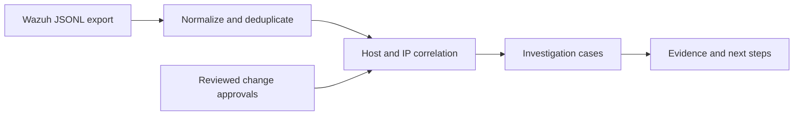

# Security Monitoring & Investigation Lab

[](https://github.com/StoryWright/security-monitoring-lab/actions/workflows/ci.yml)

An offline investigation pipeline for selected Wazuh export events, with a reproducible fixture, incident reports, endpoint configuration fragments, and an optional test of the actual Wazuh rule engine.

**Current status:** local Node parsing, correlation, reports, and tests are runnable. The included data is synthetic. Wazuh and Sysmon have not been installed in a live lab; native Wazuh rule validation is pending.

## Run the replay

Use Node.js 22 or newer in this folder:

```text
node --test
node scripts/demo.js
```

Open `reports/demo/index.html`. The fixture contains 16 events and produces three investigation cases:

- Repeated failed authentication, with a nearby successful sign-in and process event as context.
- An administrator-group change without a matching supplied approval.
- A monitored file modification without a matching supplied approval.

Five spaced retries and two separately approved changes are negative controls. `reports/demo/evaluation.json` compares the output with three labeled positive scenarios and those three controls. Passing this small designed fixture is not a real-world detection accuracy estimate.

## Analyze an authorized export

```text
node src/cli.js --input fixtures/events.jsonl --context fixtures/context.json --output-dir reports/my-replay --strict
```

Choose a new or empty output folder for each run. Results include `report.json`, `index.html`, and an `INC-###.md` file for every case. Exit codes are `0` completed, `1` usage/I/O error, and `3` rejected input with `--strict`.

One complete JSON object is required per line. The CLI accepts selected Wazuh `alerts.json` structures, not an arbitrary dashboard search response or array. It normalizes Windows 4624/4625 authentication events with a source IP; 4728/4732 additions to Domain Admins or local Administrators identified by SID; Sysmon event 1; Wazuh file modifications; and Linux authentication groups with `srcip`. A small `integration: "storylab"` schema supports reproducible rule testing.

## Correlation rules

Failed sign-ins are grouped by monitored host **and** source IP. Five failures in an inclusive 300-second window create one case for an active burst. Approved change IDs are read from a separate, reviewed context file. A claim of approval embedded in an event does not suppress a finding. Missing approval means investigation is needed; it does not prove malicious activity.

Cases retain original event IDs and nearby successful sign-ins/processes on the same host. Context spans 60 seconds before the first evidence event through 600 seconds after the last, capped at 20 records. It is temporal context, not proof that a process belongs to the same user session or caused the incident.

## Native Wazuh configuration

`wazuh/storylab_rules.xml` defines custom IDs 100100–100105 for classifying demonstration JSON events. **Those rules do not implement the Node time-window correlation.** The manager's ordinary Windows/Linux/FIM rules handle endpoint events; the local Node tool analyzes their exported records.

The agent files are fragments to merge into existing configuration. Do not replace a complete `ossec.conf` with a fragment. Check for duplicate collection blocks first. Follow [LIVE-SETUP.md](LIVE-SETUP.md) for installation, telemetry checks, native rule testing, and evidence collection.

```text
python3 scripts/verify_wazuh.py
```

Run this inside a configured Wazuh manager with appropriate read/execute permissions. It invokes `/var/ossec/bin/wazuh-logtest` on the five fixture events, compares matched rule IDs, and writes an actual native-validation report. If the binary is absent, it exits with “NOT RUN” and does not create a passing report. XML syntax checks alone do not prove Wazuh will accept or match these rules.

## Limitations

The tool does not install agents, collect logs continuously, contain endpoints, change permissions, or certify that a supplied file is genuine. Unsupported event types are counted as ignored. Local sign-ins with missing source IPs are rejected from source-IP analysis. Duplicate event IDs are discarded; a repeated ID with altered content will also be discarded. Limits are 64 MiB per CLI input, 64 KiB per line, and 100,000 normalized events. Input and context are buffered; context lookup scans the event list per case, so high-case-volume performance needs further work.

Tests cover parsing, timestamp validity, host separation, approval handling, false-positive controls, output escaping, and CLI evidence preservation. Local logs are included in `reports/local-validation/`. The Actions tab records hosted workflow outcomes.

References: [Wazuh custom rules](https://documentation.wazuh.com/current/user-manual/ruleset/rules/custom.html), [log collection configuration](https://documentation.wazuh.com/current/user-manual/reference/ossec-conf/localfile.html), [Microsoft Sysmon](https://learn.microsoft.com/en-us/sysinternals/downloads/sysmon).


## Architecture


